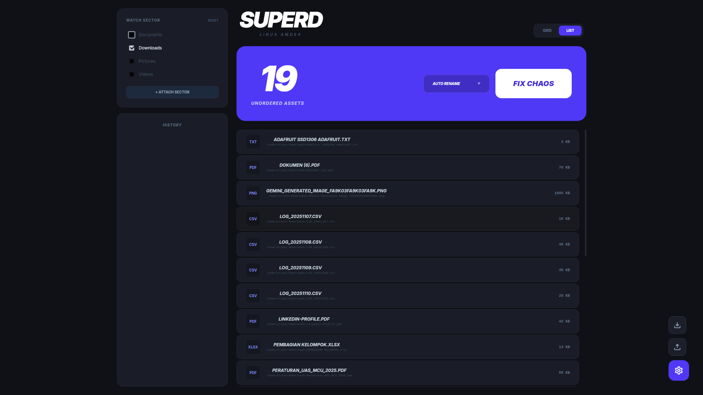

# SuperD



A high-performance desktop file organizer that turns chaos into zen.

Designed for Linux with seamless compatibility for Windows and macOS.

## 🧠 Core Engine

SuperD’s backend is built with Wails (Go) and centers on a Smart Priority Engine and an auditable Undo System.

### Smart Priority Engine (Specificity Scoring)
- Rules consist of an Extension Pool and/or a Pattern (supports wildcard `*` and single-character `?`).
- Each rule gets a specificity score:
	- Pattern present: `1000 + len(pattern without * or ?)`
	- Extensions present: `+100`
- Rules are applied in descending score order, so specific patterns beat generic extension rules. For example, `NIM_*.pdf` will route before a generic `.pdf` rule.
 
 Example:
 - Given a file `NIM_Tugas.pdf` and two rules: `pattern = "NIM_*"` vs `extensions = [".pdf"]`.
 - Scores: `NIM_*` → `1000 + len("NIM_") = 1004`; extension-only → `100`.
 - Result: the `NIM_*` pattern wins and the file is routed to its target directory even though it also matches `.pdf`.
- Destination resolution:
	- If a matching rule’s `TargetDir` is relative, it is resolved inside the current sector.
	- Files with no match are sent to `!Uncategorized`.
- Conflict handling is explicit:
	- `skip` — leave existing files untouched
	- `rename` — prefix with a timestamp for a deterministic rename
	- `overwrite` — move/copy over the destination when supported by the OS

### Undo System (History Log)
- Every organize operation is recorded as a transaction with a list of per-file moves.
- `UndoByID` walks the transaction in reverse and restores each file to its original location.
- The history is persisted (capped to the most recent entries) for reliability and quick recovery.

## 🎨 Frontend

The UI is implemented in Svelte 5 (Runes) with Tailwind 4 utility classes, focused on clarity and speed:
- Flat Professional UI: deliberately avoids backdrop-blur and similar GPU-heavy effects to eliminate overhead, ensuring 60FPS scrolling on large datasets.
- Watch Sectors panel: toggle and manage folders being monitored.
- Real-time counters and progress states for scanning and organizing.
- Smart Conflict Detector: flags identical triggers (same `pattern` + `extension`) that target different folders, making conflicting rules obvious.
- Schema Architect: an inline editor to create, adjust, import, and export rule sets.

## 🚀 Key Features
- Smart Pattern Matching (wildcards `*` and single-char `?`)
- Specificity Scoring: precise patterns win over generic extensions
- Watch Sectors management with quick attach/reset controls
- Conflict strategies: skip, rename, overwrite
- Undo System with per-transaction rollback
- Logic Merging: import/export rules and merge without duplicating names
- Sensible defaults: Images/Documents rules out of the box; uncategorized fallback

## 📁 Ready-to-use Templates
Prefer a head start? Import curated JSON templates from `/templates` tailored to common workflows:
- **Standard Zen** — balanced defaults for everyday organization.
- **Developer Pro** — tuned for logs, backups, and code artifacts.
- **Media Creator** — optimized for photos, videos, and creative assets.

## 🤝 Why Wails + Svelte 5?
- Native feel without bundling a full browser: Wails provides lightweight desktop shells across Linux, Windows, and macOS.
- Modern reactive state management: Svelte 5 Runes offers fine-grained reactivity with minimal boilerplate.
- Performance-first frontend: Tailwind utility classes and flat visual choices keep the UI responsive on large file sets.
- Simple cross-boundary calls: Go methods are exported to the frontend, enabling straightforward orchestration of scans and moves.

## 🛠️ Installation

Prerequisites:
- Go 1.25+
- Node.js 22+
- Wails v2 CLI

Linux dependencies:
```
Ubuntu / Debian
sudo apt install libgtk-3-dev libwebkit2gtk-4.0-dev gcc g++ make pkg-config

Arch / CachyOS
sudo pacman -S webkit2gtk gtk3 devtools

Fedora
sudo dnf install gtk3-devel webkit2gtk3-devel gcc-c++ make
```

Windows
- Requires WebView2 Runtime (Win10/11 include it) and a C compiler (e.g., Mingw-w64) if building from source.

macOS
- Requires Xcode Command Line Tools.

Setup and Run:

```bash
# Install Wails CLI (once)
go install github.com/wailsapp/wails/v2/cmd/wails@latest

# Install frontend dependencies
cd frontend
npm install
cd ..

# Live development
wails dev

# Production build (optimized)
wails build -ldflags "-s -w"
```

Artifacts are generated under `build/` for distribution.

First-run initialization:
- SuperD creates a hidden directory at `~/.superd` to persist state and configuration.
- `config.json` — UI preferences (view mode, conflict mode) and active watch sectors.
- `schema.json` — your rule set: patterns, extension pools, and target directories.
- `history.json` — transaction log used by the Undo System to restore previous file locations.

## 🗂️ Project Structure
- `/app.go`: Core application logic and OS bridge.
- `/history.go`: Transactional undo/redo engine.
- `/frontend/src`: Svelte 5 reactive components and professional flat theme.
- `/build`: Production assets and platform-specific manifests.

## ⚖️ License

Copyright © 2025. All rights reserved.
